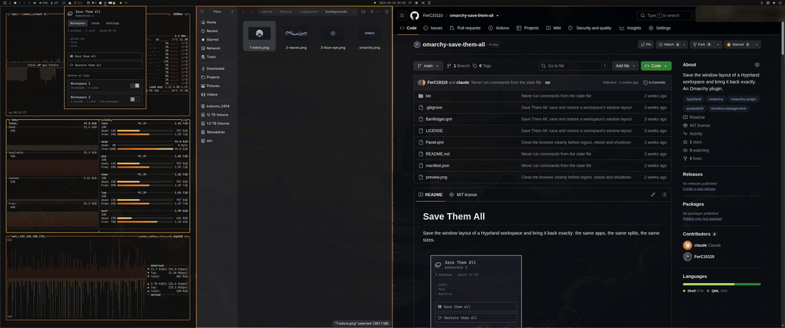
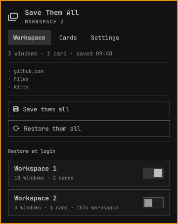
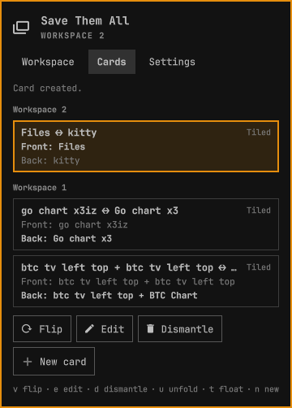
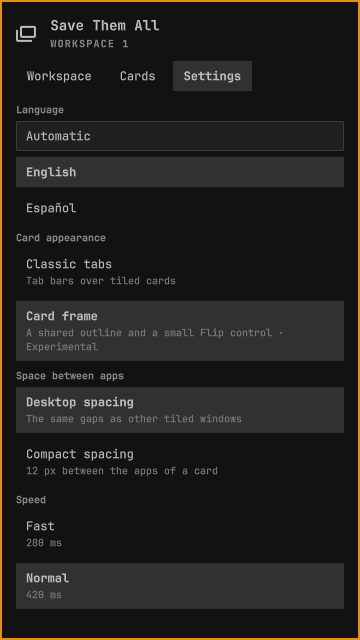
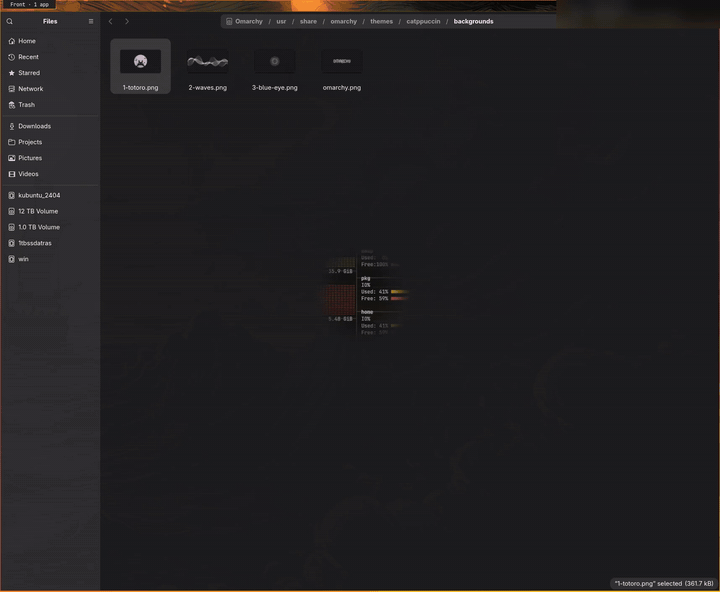
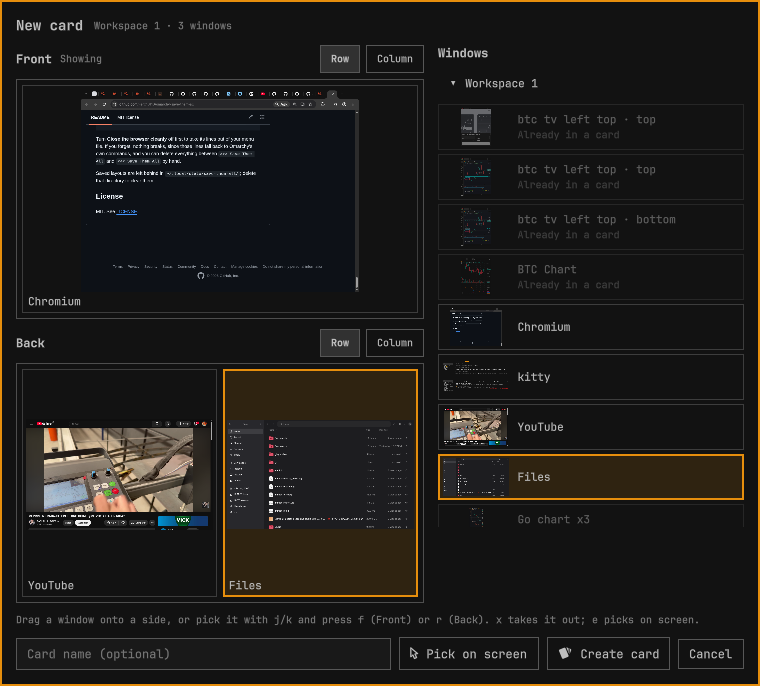
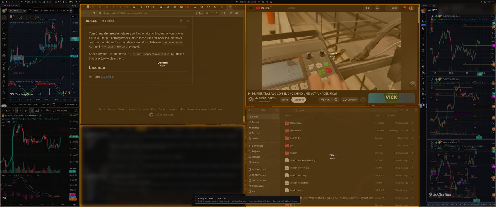
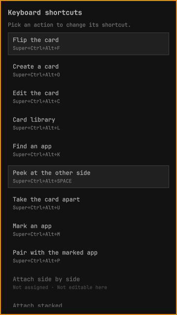
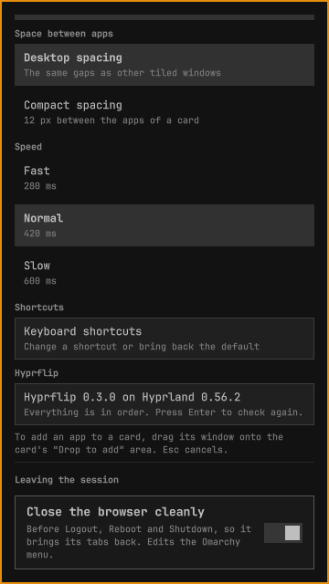

# Save Them All

Save the window layout of a Hyprland workspace and bring it back exactly: the
same apps, the same splits, the same sizes, and the same flip cards.



Omarchy restores your session, not your arrangement. You reopen the browser,
the terminal and three chart webapps, then spend a minute dragging them back
into the shape you actually work in. Save Them All records that shape once and
replays it on demand, or on its own every time you log in.

With [Hyprflip](https://github.com/nocstah/hyprflip) it also keeps **flip
cards**: windows grouped on two sides that flip in the same place. Save Them
All builds them, saves them with the workspace and brings them back.

## Install

```sh
omarchy plugin add https://github.com/FerC10110/omarchy-save-them-all.git --enable
```

The bar gains a 󱂬 button on the right. It stays dim until the workspace you
are on has a saved layout.

## The panel

Click the button to open the panel. It has three tabs: **Workspace**, **Cards**
and **Settings**. `1`, `2` and `3` jump to a tab, `h` and `l` (or the arrow
keys) step between them, and `Escape` closes the panel.

<table>
  <tr>
    <td></td>
    <td></td>
    <td></td>
  </tr>
  <tr>
    <td align="center">Workspace</td>
    <td align="center">Cards</td>
    <td align="center">Settings</td>
  </tr>
</table>

Everything in the panel works from the keyboard as well as the mouse. The
Cards tab and the card builder list their keys at the bottom.

## Usage

The **Workspace** tab shows what is saved for the workspace you are on: how
many windows and cards, when, and which apps.

- **Save them all** (`s`) records every window on the current workspace, and
  its cards.
- **Restore them all** (`r`) reopens whatever is missing, rebuilds the layout
  and builds the cards again.

Middle-clicking the bar button saves without opening the panel, which is the
action you repeat most.

Each workspace keeps its own layout, so workspace 1 and workspace 2 can hold
different arrangements and never overwrite each other.

Restoring is safe to repeat. Windows that are already open are reused rather
than launched twice, so running it on a half-open workspace fills in the gaps
instead of duplicating what is there.

### Restore at login

Below the buttons, the Workspace tab lists every workspace with a saved layout,
each with its own switch. They all start off. Turn one on and that workspace
comes back by itself the next time you log in, without opening the panel or
running anything.

With several switches on, workspaces are restored in order. Rebuilding a layout
means focusing its windows, so you will see the workspaces go by while it works;
it finishes on the workspace you started on.

It runs once per session. Restarting the shell, or the plugin reloading, does not
restore again and does not reshuffle windows you have moved since. Saving a
workspace again keeps its switch as it was.

### Cards

A card is a group of windows on two sides, **Front** and **Back**, that share
one place in the layout and flip in it: two sets of apps where there is room
for one. Each side holds up to five windows, in a row or a column.



Cards need [Hyprflip](https://github.com/nocstah/hyprflip), a Hyprland plugin,
and its helper. Without them everything else works as before, and the Cards
tab says what is missing and the command that fixes it.

#### The Cards tab

Every card on every workspace, grouped by workspace with the one you are on
first. Each shows its name, the apps on each side (the side on show in bold)
and whether it is tiled or floating.

- `v` or `Enter` flips the card chosen, `e` edits it, `d` takes it apart (its
  windows stay open), `u` unfolds it to show both sides at once, `t` floats or
  tiles it, and `n` makes a new one.
- A key that does not apply to the card chosen is greyed out in the hints:
  `u` needs a card of several apps, and `t` needs a Hyprflip with floating
  cards.

#### The builder



**New card** (`n`) opens the builder. The card is on the left, Front above and
Back below, shaped like the place it will take; the windows are on the right,
with live thumbnails, the current workspace's first.

- Drag a window onto a side, or walk the list with `j`/`k` and press `f`
  (Front) or `r` (Back). `x` takes one out.
- **Row** and **Column** set how each side lays out its windows.
- Windows that cannot join say why, like one that is already in a card.
  Two windows of the same app are told apart by where they are on screen
  (*left top*, *right bottom*).
- Windows from another workspace move to the card's when it is made, and the
  builder says so before you create it.
- The name is optional; without one, the card is named after its apps. It is
  saved with the workspace.

**Edit** (`e` in the Cards tab) opens the same builder on an existing card. A
side you leave alone keeps its proportions, and changing only the name just
renames the card.

#### Pick on screen



**Pick on screen** (`e` in the builder) covers the monitor so you can click the
windows themselves. Each one picked is labelled with its side, `Tab` switches
the side you are adding to, `Enter` goes back to the builder with them and
`Esc` goes back without changes. It stays on the monitor and workspace where it
opened, and cancels if that workspace changes or the monitor is unplugged.

#### Hyprflip's settings and shortcuts



With Hyprflip loaded, **Settings** also holds its preferences: the card's
appearance (classic tab bars or a card frame), the space between the apps of a
card, the animation (flip, vertical, slide, fade or instant) and its speed. A
speed set by hand in Hyprflip's config shows as *Custom*. Under them, a line
says which Hyprflip is loaded and whether all is well; `Enter` checks again.

**Keyboard shortcuts** lists Hyprflip's own, with conflicts called out.
Editing one is keyboard-driven: `Enter` starts recording, then saves the chord
just captured; `d` brings back the default; `Esc` cancels, the recording first,
then the row. Hyprland's own shortcuts stand aside only while a new one is
being recorded.

#### Saving and restoring cards

**Save them all** saves the workspace's cards too, and **Restore them all**
builds them again after the windows, once it has switched back to the saved
workspace; if that workspace will not stay focused, cards are skipped with a
note and every window is left visible rather than hidden. A card that is
already built is left alone and the other windows go back around it, and a
window already in another card or group is never touched. If Hyprflip is not there, or its helper cannot build whole
cards — too old, missing support for grouping windows, or a card with more
windows on one side than it can hold — each card comes back instead as a
native Hyprland group with tabs, the side that was on show in front, with a
note saying why.

If Hyprflip stops loading while cards are built (after a Hyprland update, for
instance), the Workspace tab says **Cards paused** and offers **Show both
faces**, which takes every window on the workspace out of its group.

### Language

Settings → Language: Automatic (the system language), English or Español. The
notifications follow it too.

### Close the browser cleanly

This is the one switch that reaches outside the plugin's own files, so it starts
off, and it is worth knowing what it does before you turn it on.

**Why it exists.** Omarchy's Logout, Reboot and Shutdown do not tell running apps
that the session is ending. They close every window one at a time, and the
session ends a couple of seconds later. For Chromium that is an abrupt ending,
and it costs the browser its tabs in one of two ways:

- To Chromium, windows closed one by one look exactly like you closing them by
  hand, so each one is dropped from the session. At best the next start brings
  back only the last window that was closed.
- If the session ends while Chromium is still shutting down, it is cut off
  halfway and records the exit as a crash. After a crash Chromium never restores
  by itself, even with *Continue where you left off* turned on: it opens an
  empty window and waits for you to click **Restore**.

That undoes the login restore as well. The plugin starts the browser first and
waits for it to bring its tabs back, but there is nothing to bring back. Clicking
**Restore** afterwards drops the tabs into a layout that was already arranged
and pushes it around, and reopening them from the history also reopens the
webapps the plugin already opened, so they show up twice.

Chromium keeps its whole session when it is asked to quit as a whole, which is
what **⋮ → Exit** does. It then comes back with every tab on the next start, and
the plugin only has to open the webapps, which Chromium never restores itself.



**What the switch does.** **Close the browser cleanly**, at the bottom of
Settings under *Leaving the session*, makes Logout, Reboot and Shutdown in the
Omarchy menu do that first: they ask the browser to quit, wait up to ten
seconds for it to finish saving, and then run Omarchy's own command, which
finds no browser windows left to close.

To get there it adds these lines to
`~/.config/omarchy/extensions/omarchy-menu.jsonc`, the file Omarchy gives you for
customizing its menu:

```jsonc
// >>> Save Them All: close the browser cleanly before Logout, Reboot and Shutdown,
// so it brings its tabs back. Added by the plugin's panel; turn the switch off
// there to remove these lines. Without the plugin they run Omarchy's own command.
"system.logout": {"icon": "󰍃", "label": "Logout", "action": "p=$HOME/.config/omarchy/plugins/io.github.ferc10110.save-them-all/bin/close-browser-at-logout; [ -x \"$p\" ] && exec \"$p\" omarchy-system-logout; exec omarchy-system-logout"},
"system.reboot": {"icon": "󰜉", "label": "Reboot", "action": "p=$HOME/.config/omarchy/plugins/io.github.ferc10110.save-them-all/bin/close-browser-at-logout; [ -x \"$p\" ] && exec \"$p\" omarchy-system-reboot; exec omarchy-system-reboot"},
"system.shutdown": {"icon": "󰐥", "label": "Shutdown", "action": "p=$HOME/.config/omarchy/plugins/io.github.ferc10110.save-them-all/bin/close-browser-at-logout; [ -x \"$p\" ] && exec \"$p\" omarchy-system-shutdown; exec omarchy-system-shutdown"},
// <<< Save Them All
```

- **Only the action changes.** The entries keep Omarchy's own icons and labels,
  and the command at the end of each line is the one Omarchy runs by default.
- **Nothing else is touched.** No Omarchy files, no other config, nothing that
  runs outside those three menu entries.
- **Removing the plugin cannot break them.** Each line checks that the plugin's
  script is still there and otherwise runs Omarchy's command directly.
- **Turning the switch off takes the lines out again** and leaves the rest of
  the file exactly as it was.
- **Your own changes win.** If your menu file already customizes Logout, Reboot
  or Shutdown, the switch stays off and says so instead of overriding them.

It closes Chromium and, going by their process names, the browsers built on it:
Google Chrome, Brave, Vivaldi and Edge. It has been tested with Chromium only.
Firefox is left alone. Only the menu entries change, so
`omarchy system reboot` in a terminal, or a keybinding that runs those commands
directly, still closes windows the old way; put `close-browser-at-logout` in
front of them there, as shown below.

### From the menu, a keybinding or the terminal

The scripts are plain bash and work on their own. Put them on your `PATH`:

```sh
for s in save-them-all restore-them-all restore-them-all-at-login close-browser-at-logout; do
  ln -s ~/.config/omarchy/plugins/io.github.ferc10110.save-them-all/bin/$s ~/.local/bin/
done
```

`restore-them-all --workspace 3` restores workspace 3 from anywhere. The panel's
switches are available too:

```sh
restore-them-all-at-login --list        # every saved workspace and its switch, as JSON
restore-them-all-at-login --enable 3    # restore workspace 3 at login
restore-them-all-at-login --disable 3

close-browser-at-logout --status        # whether the menu entries are in place, as JSON
close-browser-at-logout --enable        # add them
close-browser-at-logout --disable       # take them out
close-browser-at-logout omarchy-system-reboot   # quit the browser cleanly, then reboot
```

A keybinding in `~/.config/hypr/bindings.lua`:

```lua
o.bind("SUPER + SHIFT + S", "Save them all", "save-them-all")
o.bind("SUPER + SHIFT + O", "Restore them all", "restore-them-all")
```

Entries in the Omarchy menu, in `~/.config/omarchy/extensions/omarchy-menu.jsonc`:

```jsonc
"windows": {"icon":"󱂬","label":"Windows"},
"windows.save": {"icon":"󰆓","label":"Save them all","action":"save-them-all"},
"windows.restore": {"icon":"󰑓","label":"Restore them all","action":"restore-them-all"},
```

## How it works

`save-them-all` walks the windows of the active workspace, sorted left to right
and top to bottom, and writes one JSON file per workspace to
`~/.local/state/save-them-all/`. For each window it records the position, the
size, and which launcher can bring it back:

| Window | Saved as | How it is reopened |
|---|---|---|
| Chromium webapp | `webapp` and its URL | `omarchy-launch-webapp`, with the URL of the `.desktop` file that produces that window class, else the URL rebuilt from the class |
| Browser | `browser` | `omarchy-launch-browser` |
| Terminal | `terminal`, with `herdr` or `tmux` when the process tree has one | `omarchy-launch-terminal`, running `herdr` for a herdr session, or `omarchy-launch-terminal-tmux` |
| Anything else | `app` and its desktop entry | The installed desktop entry, through `uwsm-app` |

An app's desktop entry is found the way docks and launchers match windows to
apps: by its `StartupWMClass`, by an entry named after the window class, or by
the program it runs. A window with no desktop entry is still saved and put back
in its place when it is open, but restoring cannot reopen it.

`restore-them-all` then opens whatever is missing and rebuilds the layout.
Reopening the windows in the right order is not enough: dwindle splits each new
window against the aspect ratio of the one it lands on, so an arrangement with
cuts that don't follow from that ratio comes back wrong. Instead the script
derives the tree of guillotine cuts from the saved rectangles, parks every
window on a hidden workspace, and reinserts them one at a time with an explicit
`preselect` before each. Sizes are settled at the end with relative resizes that
read back the real geometry, because an exact resize is only reliable while a
window floats.

Floating windows skip all of that and are placed directly, and windows that were
open but never saved come back to the right of the last one.

When the browser is not running yet, as right after logging in, it is started
first and given time to finish restoring its own last session. Only then does
the script count what is still missing, so it does not launch a window the
browser was about to bring back.

The login restore is started by the plugin's service when the shell loads it,
and runs detached from the shell. Before doing anything it claims a marker named after
the Hyprland instance in `$XDG_RUNTIME_DIR/save-them-all/`. That directory is
private to your user and emptied when the session ends, so the marker means
"this session has been restored" and nothing more.

`close-browser-at-logout` sends the browser process the same quit signal an
orderly system shutdown sends, and Chromium handles it like **Exit**: every
window closes at once and the session is written whole. Only the browser process
itself gets it, not the renderer and GPU processes Chromium runs next to it,
which it takes down on its own. The script waits for that process to exit, then
hands over to the command it was given.

Chromium also has a `--restore-last-session` flag, which looks like a simpler
way to get the tabs back at login. It is no help here: Chromium deliberately
ignores it after a crash, so that a page that brought the browser down cannot
bring it down again on every start. The session has to end cleanly in the first
place, which is why the fix sits in front of Logout, Reboot and Shutdown.

The menu file is JSONC and yours, comments included, so the switch edits it as
text: its lines sit between the two marker comments and are added or removed
whole. Every write is checked to still parse the way the Omarchy menu reads it
before it replaces the file.

The state files are plain JSON and meant to be edited. Change a size, drop a
window, or write a layout from scratch and restore it:

```json
{"workspace": 1, "windows": [
  {"class": "chromium", "launch": {"kind": "browser"}, "at": [0, 26], "size": [1280, 1414], "floating": false},
  {"class": "kitty", "launch": {"kind": "terminal", "session": "tmux"}, "at": [1280, 26], "size": [1280, 1414], "floating": false},
  {"class": "chrome-youtube.com__-Default", "launch": {"kind": "webapp", "url": "https://youtube.com/"}, "at": [2560, 26], "size": [1280, 1414], "floating": false},
  {"class": "mpv", "launch": {"kind": "app", "desktop": "mpv.desktop"}, "at": [100, 100], "size": [800, 450], "floating": true}
]}
```

Cards go in the same file, in an optional `cards` block. Each card lists its
two sides by their windows' positions in `windows`, with the axis and the
proportions of each side, the side on show, where a floating card was, and its
name:

```json
"cards": [
  {"name": "Work", "visible": 0, "floating": null, "faces": [
    {"windows": [1], "axis": "row", "ratios": [1.0]},
    {"windows": [2], "axis": "row", "ratios": [1.0]}
  ]}
]
```

Restoring builds them through Hyprflip's helper once every window is in its
place, and without Hyprflip turns each one into a native group with tabs.

A state file never holds a command, and nothing in it is ever run as one.
`launch` picks one of the four launchers above and gives it, at most, a URL or
a desktop entry id as a single argument. An app can only be one that is
installed, the same as picking it from the app launcher. Before anything
happens, the whole file is checked: an unknown launcher, a desktop entry given
as a path, or a size or position that is not a whole number stops the restore
with a notification naming the window, rather than being passed on.

Layouts saved by version 1.2 or older hold a command line instead. Those still
restore when the command is one of the Omarchy launchers above; a window saved
with any other command stays unopened until you save its workspace again.

## Configure

```sh
omarchy bar move io.github.ferc10110.save-them-all --section left
```

| Variable | Default | Meaning |
|---|---|---|
| `SAVE_THEM_ALL_STATE` | `~/.local/state/save-them-all` | Where layouts are kept |
| `SAVE_THEM_ALL_TIMEOUT` | `25` | Seconds to wait for a window to appear |
| `SAVE_THEM_ALL_LOGIN_DELAY` | `3` | Seconds to let the session settle before restoring at login |
| `SAVE_THEM_ALL_RUNTIME` | `$XDG_RUNTIME_DIR/save-them-all` | Where the once-per-session marker lives |
| `SAVE_THEM_ALL_BROWSERS` | `chromium\|chrome\|brave\|vivaldi-bin\|msedge` | Browser process names to close cleanly, as a `pgrep` pattern |
| `SAVE_THEM_ALL_QUIT_TIMEOUT` | `10` | Seconds to wait for the browser to quit before going on anyway |
| `SAVE_THEM_ALL_MENU` | `~/.config/omarchy/extensions/omarchy-menu.jsonc` | The menu file the switch edits |
| `SAVE_THEM_ALL_LANG` | the Language setting | `en` or `es` for the scripts' notifications |
| `SAVE_THEM_ALL_HYPRFLIP_HELPER` | `~/.local/lib/hyprflip/control.py` | Hyprflip's helper |
| `SAVE_THEM_ALL_HYPRFLIP_SRC` | `~/.local/src/hyprflip-omacards` | Where Hyprflip's source is, for the fix commands shown |
| `SAVE_THEM_ALL_HELPER_TIMEOUT` | `30` | Seconds a card may take to build before restoring gives up on it (checking the helper waits this long too, 15 at most) |
| `SAVE_THEM_ALL_PAUSE` | `0.25` | Seconds to let Hyprland settle after each move while a card is grouped as tabs (without Hyprflip) |

## Requirements

Omarchy 4 with Hyprland 0.56 or newer, on the dwindle layout. It leans on
`hyprctl`'s Lua dispatchers, which replaced the old string syntax in 0.56, and
on `jq`, `python3` and `pstree`, all of which ship with Omarchy.

Cards are optional and need Hyprflip 0.3 with its helper (protocol 1).
Building whole cards and taking them apart need a helper with the `create`
(with sides) and `unpair` actions; an older helper still flips and edits
nothing, and restoring falls back to native groups.

## Limitations

- **Dwindle only.** The tree reconstruction is guillotine cuts; master and
  scrolling layouts are not handled.
- **One monitor's workspace at a time.** A layout belongs to a workspace id, and
  restoring targets whichever workspace is active.
- **Login restore needs the plugin enabled.** Its service is what starts it,
  so a disabled plugin restores nothing at login.
- **Closing the browser cleanly covers the Omarchy menu only.** Logout, Reboot
  and Shutdown started some other way still close the browser abruptly, and so
  does a power cut or a frozen machine.
- **Chromium is a single instance.** Its windows are created by the process
  that is already running, so they are arranged after the fact rather than
  placed as they open. When the browser restores its own last session, those
  windows open on whichever workspace is on screen at that moment, which may
  not be the one they were saved on.
- **Apps are matched by window class and count.** Two windows of the same app
  are told apart by their position in the saved order, not by their content.
- **A terminal comes back as a terminal.** It reopens through Omarchy's own
  launcher so a `herdr` or `tmux` session is picked up again, which also means
  a terminal that was running something else starts empty.
- **An app comes back as a fresh start.** It reopens from its desktop entry,
  like launching it from the menu, so a player or editor comes back without
  the file it had open. An app with no desktop entry is arranged when it is
  already open, and never launched.
- **A card lives on one workspace.** Its windows move there when it is made.
- **A card's hidden side has no live thumbnail.** Hyprland does not draw it, so
  the builder shows its last picture, or its icon.
- **A tiled card lands where Hyprflip puts it.** The plugin gives it an axis,
  an order and proportions; Hyprflip decides its exact place in the layout. A
  floating card keeps the position and size it was saved with.
- **Hyprflip's helper speaks Spanish.** In English the panel translates the
  messages it knows; one it does not (a new or reworded one) shows as the
  helper wrote it.

## Remove

```sh
omarchy plugin remove io.github.ferc10110.save-them-all
```

Turn **Close the browser cleanly** off first to take its lines out of your menu
file. If you forget, nothing breaks, since those lines fall back to Omarchy's
own commands, and you can delete everything between `>>> Save Them All` and
`<<< Save Them All` by hand.

Saved layouts are left behind in `~/.local/state/save-them-all/`; delete that
directory to clear them.

## License

MIT. See [LICENSE](LICENSE).
